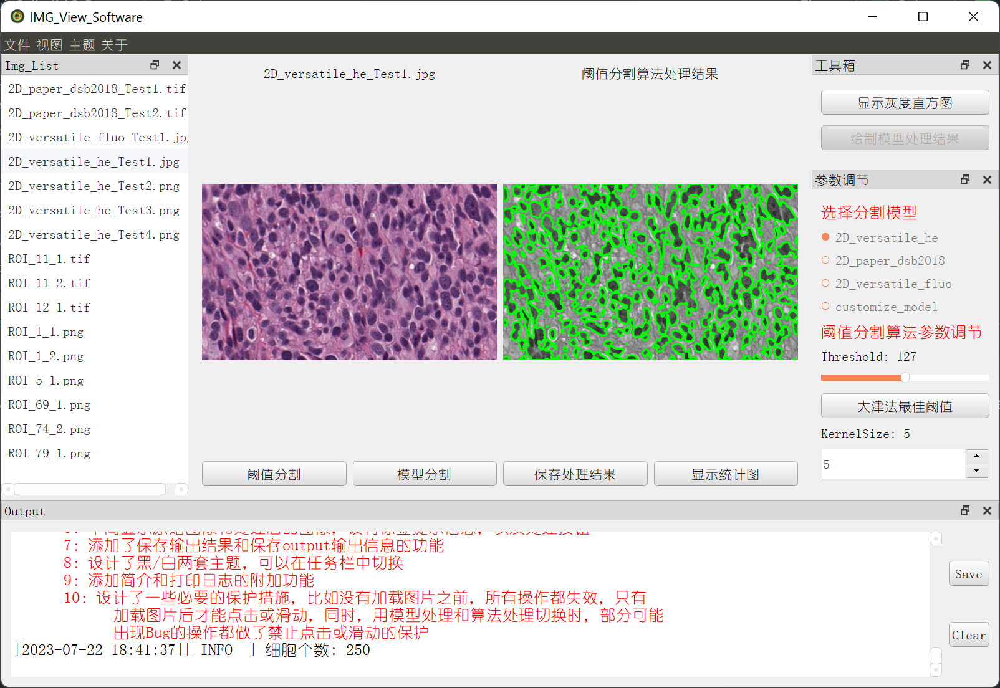

## <font color="yellow">简历个人作品详细介绍</font>
### <a name="目录"></a>目录

#### [完全模型组智能车竞赛](#第一部分)
#### [多种人机交互方式的电子小制作](#第二部分)
#### [倒立摆专业课程设计](#第三部分)
#### [细胞分割软件开发](#第四部分)

---

### <font color="yellow"><a name="第一部分"></a>一：完全模型组智能车竞赛</font>
#### [1.1 效果展示图](#1.1)

<center>图1-1 实物展示图</center>

#### [1.2 简介](#1.2)

```
    全国大学生智能车竞赛，我们参赛的组别是：完全模型组，主要成员，两个软件，一个硬件，软件一个负责编写图像处理，赛道识别的代码实现，
另一个负责运动控制、辅助调试相关的代码实现。涉及到包括：AI模型的训练、基础赛道识别的算法实现、电机舵机算法运动控制、串口协议通信、
信息传递与处理、匿名助手波形、PID调试、按键屏幕功能设计、车模结构优化等等。
```

#### [1.3 成绩](#1.3)
第十八届全国大学生智能车华南赛中获得一等奖
#### [1.4 硬件资源、软件平台](#1.4)
- Edgeboard Linux开发板（赛道图像处理）、RT1064最小系统板（智能车运动控制）、vscode、keil、NVC、匿名助手
#### [1.5 主要完成的内容](#1.5)
- 主要负责智能车的运动控制的实现与优化：电机舵机PID控制、陀螺仪角度控制。
- 与上位机串口通信协议的设计与实现。
- 部分赛道元素的控制：出入库、侧方位停车、陡坡等
- 各种调试、测试、选型：陀螺仪性能测试与选择、程序运行一些数据的波形显示，QT串口调试软件
- 屏幕、按键等等调试方面的功能实现
- 协助上位机软件同学完成赛道图像处理算法
#### [1.6 部分资源位置](#1.6)
- 下位机部分程序（/Icar/RT1064_Code）
- 自行开发的QT上位机（/Icar/QT_Code）

---

### <font color="yellow"><a name="第二部分"></a>二：多种人机交互方式的电子小制作</font>
#### [2.1 效果展示图](#2.1)


<center>图2-1 自制PCB设计图</center>


<center>图2-2 实物展示图</center>

#### [2.2 简介](#2.2)
```
    本电子小制作基于手里的模块资源制作的相对综合一点的Project。
突出点：集成了多种交互方式，方便控制和信息传输。
```

#### [2.3 硬件资源、软件平台](#2.3)
- ESP32、STM32、各种传感器、腾讯云服务器、MQTT、蓝牙模块、语音模块
- 语言主要为C/C++
#### [2.4 主要完成的内容](#2.4)
- 0.96OLED基于u8g2完成的菜单栏设计
- 通过四个按键模拟传统的按键交互方式
- 通过特定的语音词汇与开发板进行交互和控制
- 通过手机蓝牙APP控制
- 通过MQTT远程控制
#### [2.5 部分资源位置](#2.5)
- ESP32开源程序（/Home/ESP32_Code）

---

### <font color="yellow"><a name="第三部分"></a>三：倒立摆专业课程设计</font>
#### [3.1 效果展示图](#3.1)

<center>图3-1 实物展示图</center>


<center>图3-2 软件展示图</center>


<center>图3-3 自起摆角度波形</center>

#### [3.2 简介](#3.2)
```
    实现了自动起摆和手动起摆功能、同时开发一套专用的QT上位机，用于方便修改参数、显示波形、发送控制命令等。
```

#### [3.3 硬件资源、软件平台](#3.3)
- 倒立摆套件（核心板STM32F103C8T6）、IMX6ULL MIN开发板（QT专用串口软件）
#### [3.4 主要完成的内容](#3.4)
- 创新点在于优化了人机交互的方式。开发了一个专用的上位机控制软件，使控制或调试都更加方便，增加使用体验。主要涉及的内容包括：QT软件开发、串口通信、位置环速度环PD控制、交叉编译等。
#### [3.5 部分资源位置](#3.5)
- STM32开源代码（/Inverted/STM32_Code）
- QT上位机软件（/Inverted/QT_Code）

---

- ### <font color="yellow"><a name="第四部分"></a>四：细胞分割软件设计</font>
#### [4.1 效果展示图](#4.1)

<center>图4-1 软件启动界面展示</center>


<center>图4-2 图像处理算法实现效果图</center>


<center>图4-3 模型处理效果图</center>

#### [4.2 简介](#4.2)
```
    图像处理课的软件设计，基于PyQT5开发的一款集成两中处理方法的软件。界面仿照流行的开发软件设计，风格为Linux主题风格，
能够使用阈值分割来实现细胞分割或者使用模型来进行细胞分割。
```

#### [4.3 开发介绍](#4.3)
- 主要使用Pycharm，使用Python各种第三方框架
#### [4.4 完成的内容](#4.4)
- 基于PyQT5的前端界面开发
- PushButton等控制的后端逻辑处理
- Stardist细胞分割模型的移植和加载
- opencv的图片预处理
#### [4.5 资源位置](#4.5)
- Python项目代码（/Cell/）
